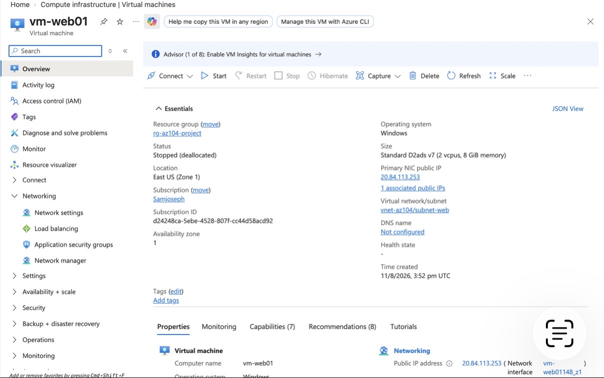
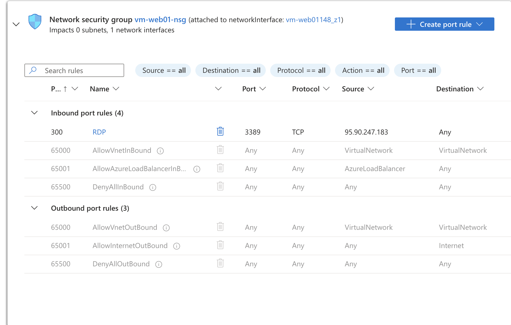
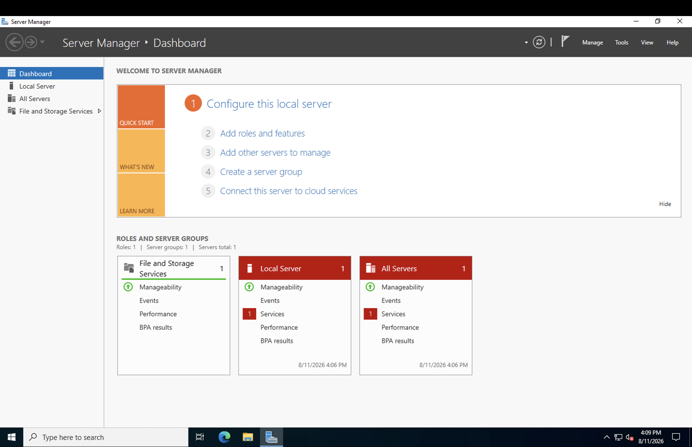
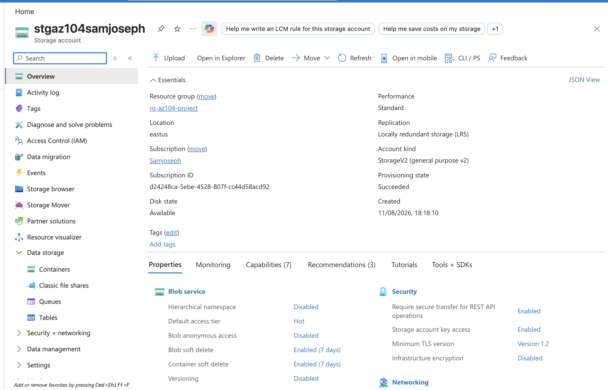
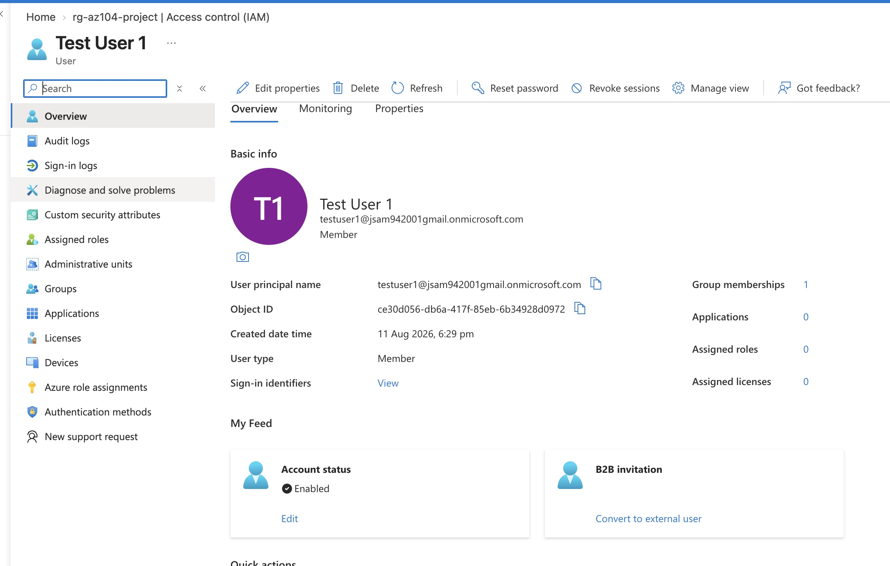

# azure-secure-vm-infrastructure

Secure multi-tier VM infrastructure on Microsoft Azure — AZ-104 practice project

## Overview

This project demonstrates a hands-on, end-to-end deployment of a secured virtual machine environment in Microsoft Azure, built while preparing for the **AZ-104: Microsoft Azure Administrator** certification. It covers core Azure administration skills: networking, compute, storage, identity, and access control.

## Architecture

- **Resource Group**: `rg-az104-project` — logical container for all resources
- **Virtual Network**: `vnet-az104` with a dedicated subnet (`subnet-web`)
- **Virtual Machine**: `vm-web01` — Windows Server 2022
- **Network Security Group (NSG)**: RDP (port 3389) access locked down to a single trusted IP address
- **Storage Account**: LRS-redundant storage account with a blob container for file storage
- **Identity**: Two test users created in Microsoft Entra ID, grouped into a security group
- **Access Control (RBAC)**: Reader role assigned to a test user, scoped to the resource group

## Skills Demonstrated

- Provisioning and configuring Azure Virtual Machines
- Designing and securing Virtual Networks and Subnets
- Hardening remote access using Network Security Groups
- Connecting to and managing a Windows Server VM via RDP
- Creating and configuring Azure Storage Accounts and Blob Containers
- Managing users and groups in Microsoft Entra ID
- Implementing Role-Based Access Control (RBAC) following least-privilege principles
- Monitoring and managing Azure costs (budgets, quota troubleshooting)

## Steps Completed

1. Created Resource Group
2. Created Virtual Network and Subnet
3. Deployed Windows Server 2022 Virtual Machine
4. Configured NSG to restrict RDP access to a single IP
5. Connected to the VM via Remote Desktop and verified access
6. Stopped/deallocated the VM to control costs
7. Created a Storage Account and Blob Container, uploaded a test file
8. Created two test users in Microsoft Entra ID
9. Created a security group and added both test users
10. Assigned the Reader RBAC role to a test user on the resource group

## Screenshots

*(Add your screenshots here, e.g.:)*

## Notes

This project was completed using the Azure Portal to build practical, verifiable experience with core AZ-104 exam objectives ahead of certification.
